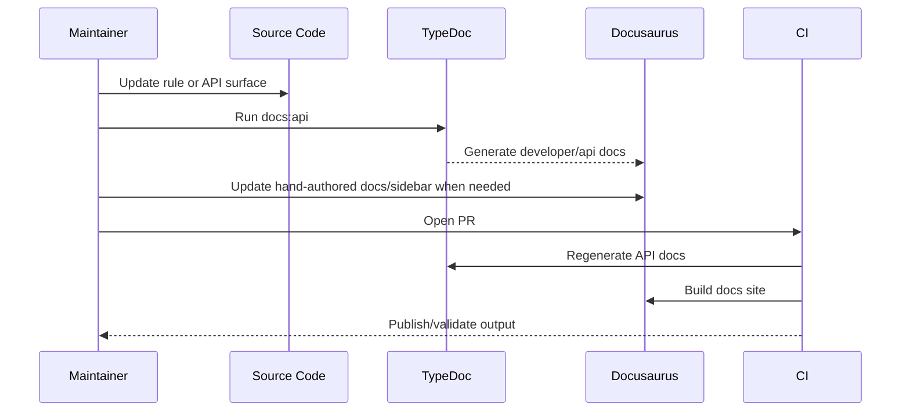

# Docs and API Pipeline

## Operational guidance

- If Docusaurus navigation breaks for API pages, regenerate TypeDoc output first.
- Keep hand-authored docs separate from generated folders to avoid churn.
