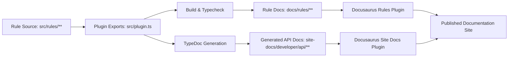

# System Architecture Overview

## Reading the diagram

- Rule behavior starts in `src/rules/**` and is surfaced through plugin exports.
- Rule documentation is hand-authored under `docs/rules/**`.
- API docs are generated and then consumed by Docusaurus.
